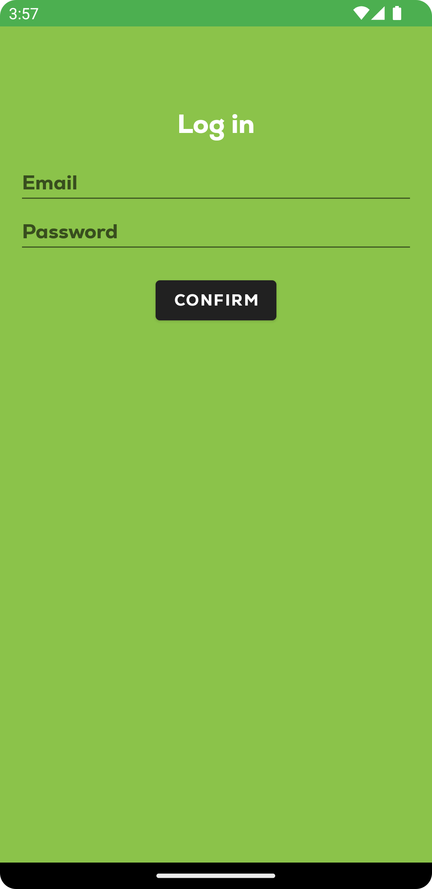
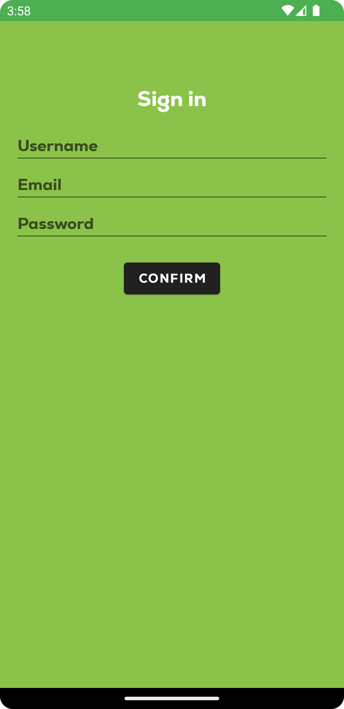
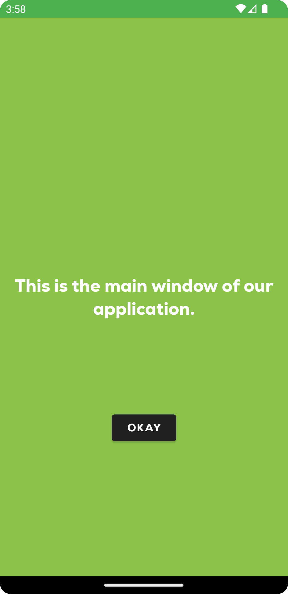

# Мобильное приложение Skatert на базе Android

Сделал простенькое приложение. Пока - только стартовое окно (с выбором авторизации или регистрации), окна авторизации, регистрации и пустое домашнее окно. Добавил стартовый функционал сохранения данных в кеше. Интерфес выглядит следующим образом:

Стартовое окно:

Окно авторизации:

Окно регистрации:

Домашнее окно:

