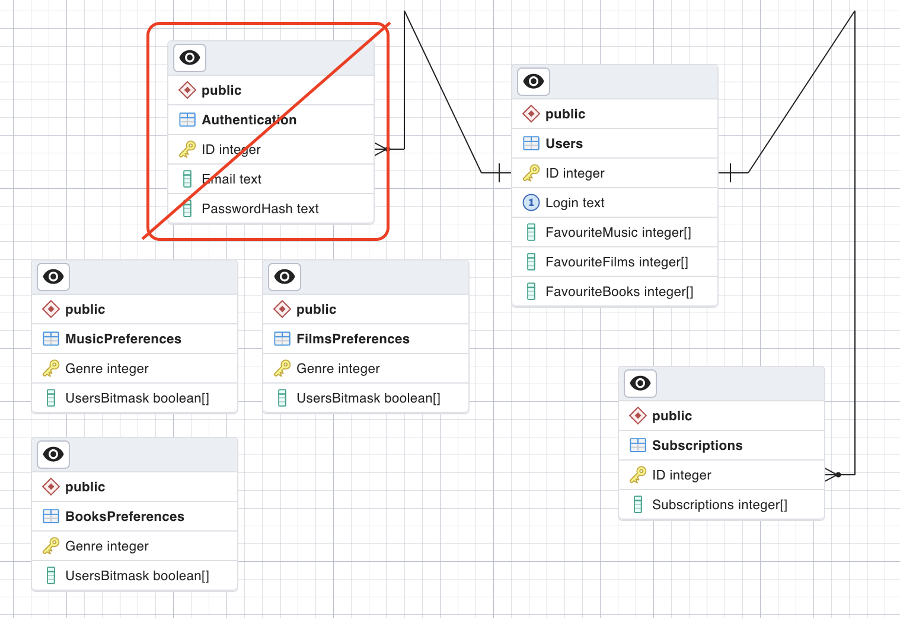

# Структура базы данных приложения Skatert

Реализовал структуру в соответствии с указаниями на YouTrack:

Из таблицы "Users (Пользователи)" убрал поля с указаниями пользовательских предпочтений. Не вижу смысла дублировать эту информацию. Ее можно получить из таблиц MusicPreferences, FilmsPreferences, BooksPreferences через
    
    SELECT Genre FROM MusicPreferences WHERE UsersBitmask[id] IS TRUE;

Для аутентификации используем таблицы Севы, на моем рисунке зачеркнут устаревший вариант с описанием с YouTrack
